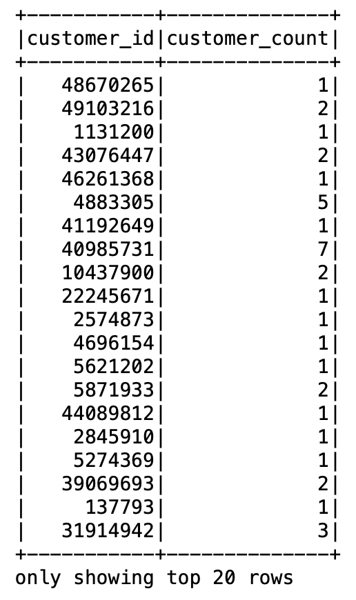
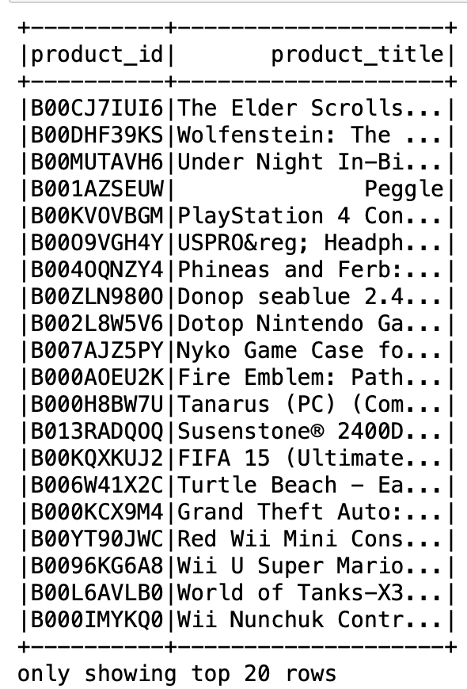
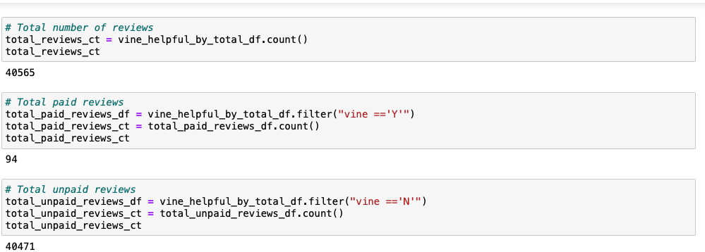
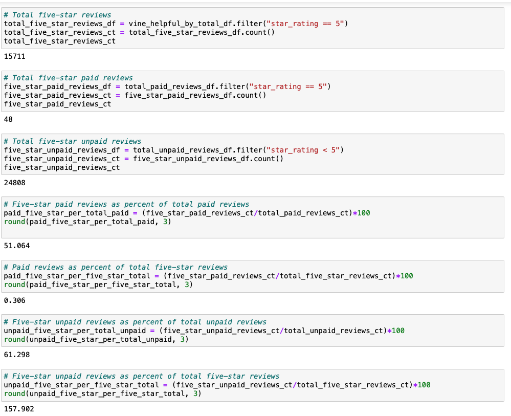

# Amazon_Vine_Analysis

## Overview of the analysis

The Amazon Vine application is a paid service that allows producers and publishers to get hold of evaluation for his or her products. Amazon Vine participants are supplied products from agencies and are required to post a review. Out of about 50 extraordinary datasets that contained opinions for multiple distinct products starting from apparel apparel to wi-fi products, I selected to attention my evaluation on video video games.

## Resources

PG Admin4, PostgreSQL, AWS, Jupyter Notebook, Google Cooble

## Results

### Amazon reviews

### Vine Reviews

